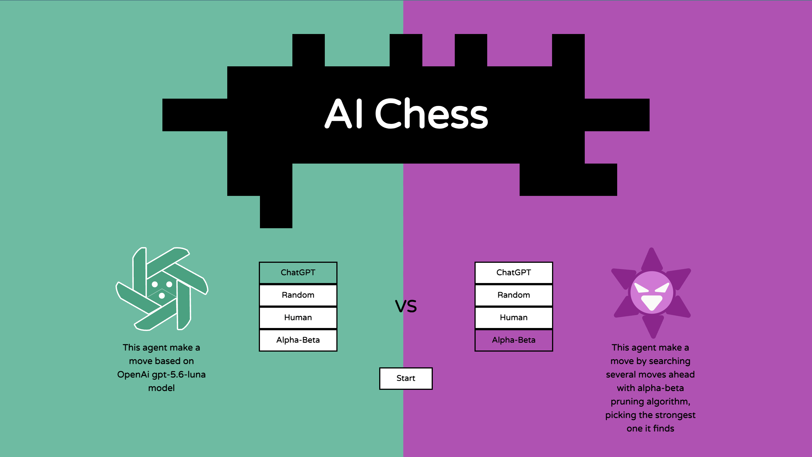

# AI Chess

This is a chess game engine where you can choose to play versus AI like GPT-5.6 Luna or minimax algorithm or you could also have the option to see the match between AI vs. AI match. The main purpose of this is to evaluate how well AI model is in term of chess logic

